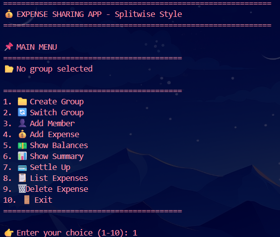
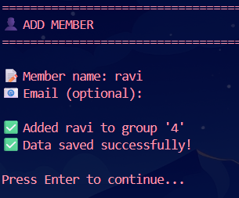
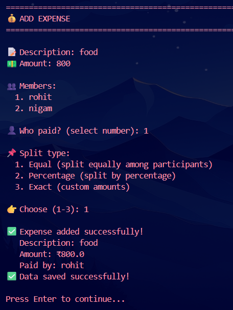
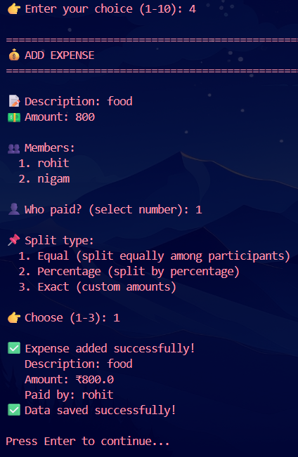

# 💰 Expense Sharing App - Splitwise Clone  

  
  
  

A powerful expense sharing application that helps groups track shared expenses, calculate balances, and simplify debts. Perfect for roommates, friends, trips, and team expenses.  

## Features  

- Group Management - Create and manage multiple expense groups  
- Member Management - Add/remove members from groups  
- Multiple Split Types - Equal, Percentage, or Exact amounts  
- Automatic Balance Tracking - Real-time balance updates  
- Debt Simplification - Minimize number of transactions  
- Settle Up - Record debt settlements  
- Expense History - View all expenses with details  
- Persistent Storage - JSON-based data storage  
- Detailed Summaries - Group statistics and member balances  
- User-Friendly CLI - Interactive menu system  

## Quick Start  

### Prerequisites  
- Python 3.7 or higher  
- No external libraries required (uses only built-in modules)  

### Installation  

1. Clone the repository:  
git clone https://github.com/poisonmunna/expensesharingapp.git  
cd expensesharingapp  

2. Run the application:  
python ExpenseSharingApp.py  

## Interactive Menu  

============================================================  
💰 EXPENSE SHARING APP - Splitwise Style  

============================================================  

📌 MAIN MENU  
========================================  
📂 Current Group: Roommates  
👥 Members: 3  
💰 Expenses: 5  

========================================  
1. 📁 Create Group  
2. 🔄 Switch Group  
3. 👤 Add Member  
4. 💰 Add Expense  
5. 💵 Show Balances  
6. 📊 Show Summary  
7. 💳 Settle Up  
8. 📋 List Expenses  
9. 🗑️ Delete Expense  
10. 🚪 Exit  
========================================  

👉 Enter your choice (1-10): 1  

## Example Usage  

### Step 1: Create a Group  

============================================================  
➕ CREATE NEW GROUP  

============================================================  

📝 Group name: Roommates  
📋 Description (optional): Shared apartment expenses  

✅ Group 'Roommates' created successfully!  

### Step 2: Add Members 

============================================================  
👤 ADD MEMBER  

============================================================  

📝 Member name: Alice  
📧 Email (optional): alice@email.com  

✅ Added Alice to group 'Roommates'  

### Step 3: Add Expenses  

============================================================  
💰 ADD EXPENSE  

============================================================  

📝 Description: Rent  
💵 Amount: 30000  

👥 Members:  
  1. Alice  
  2. Bob  
  3. Charlie  

👤 Who paid? (select number): 1  

📌 Split type:  
  1. Equal (split equally among participants)  
  2. Percentage (split by percentage)  
  3. Exact (custom amounts)  

👉 Choose (1-3): 1  

✅ Expense added successfully!  
   Description: Rent  
   Amount: ₹30000  
   Paid by: Alice  

### Step 4: View Balances  

============================================================  
💰 BALANCES - Roommates  

============================================================  

👥 Member Balances:  
----------------------------------------  
  Alice: is owed ₹20000.00  
  Bob: owes ₹10000.00  
  Charlie: owes ₹10000.00  

🔄 Simplified Debts:  
----------------------------------------  
  Bob → Alice: ₹10000.00  
  Charlie → Alice: ₹10000.00  

## Split Methods  

### 1. Equal Split  
Split the expense equally among all participants  

Example: ₹30000 rent among 3 people  
→ Each person pays ₹10000  

### 2. Percentage Split  
Split by percentage (total must be 100%)  

Example: ₹1000 dinner  
→ Alice: 50% (₹500)  
→ Bob: 30% (₹300)  
→ Charlie: 20% (₹200)  

### 3. Exact Split  
Custom amounts for each person  

Example: ₹5000 shopping  
→ Alice: ₹2000  
→ Bob: ₹1500  
→ Charlie: ₹1500  

## Debt Simplification Example  

### Before Simplification (Complex):  
Alice → Bob: ₹500  
Alice → Charlie: ₹300  
Bob → Charlie: ₹200  

### After Simplification (Minimal):  
Alice → Charlie: ₹600  
Bob → Charlie: ₹400  

### Original Complex vs Simplified  

Original: 3 transactions  
Simplified: 2 transactions  

## Settle Up Example  

============================================================  
💳 SETTLE UP  

============================================================  

📋 Outstanding debts:  
  1. Bob owes Alice ₹10000.00  
  2. Charlie owes Alice ₹10000.00  

👉 Select debt to settle (number): 1  

✅ Confirm settlement: Bob pays Alice ₹10000.00? (y/n): y  

✅ Settlement recorded!  

## Group Summary Example  

============================================================  
📊 GROUP SUMMARY - Roommates  

============================================================  
👥 Total Members: 3  
💰 Total Expenses: ₹45000.00  
📝 Number of Expenses: 3  

Member Balances:  
----------------------------------------  
  Alice: is owed ₹20000.00  
  Bob: owes ₹10000.00  
  Charlie: owes ₹10000.00  

## Expense List Example  

============================================================  
📋 EXPENSES - Roommates  

============================================================  

1. Rent  
   Amount: ₹30000.00  
   Paid by: Alice  
   Date: 2024-06-15 10:30  
   Split: equal  
   Split equally among 3  

2. Groceries  
   Amount: ₹5000.00  
   Paid by: Bob  
   Date: 2024-06-14 15:20  
   Split: equal  
   Split equally among 3  

## Data Storage  

The app uses JSON for persistent storage:  

{  
    "groups": [  
        {  
            "name": "Roommates",  
            "description": "Shared apartment expenses",  
            "members": [  
                {  
                    "name": "Alice",  
                    "email": "alice@email.com",  
                    "balance": 20000.0  
                }  
            ],  
            "expenses": [  
                {  
                    "description": "Rent",  
                    "amount": 30000.0,  
                    "paid_by": "Alice",  
                    "split_type": "equal",  
                    "participants": ["Alice", "Bob", "Charlie"],  
                    "date": "2024-06-15T10:30:00"  
                }  
            ]  
        }  
    ]  
}  

## Use Cases  

### Roommates  
- Split rent, utilities, groceries  
- Track who owes whom  
- Settle up monthly  

### Group Trips  
- Track shared expenses (hotel, food, activities)  
- Fair distribution of costs  
- Easy settlement after trip  

### Friends  
- Split dinner bills  
- Track movie tickets  
- Manage group gifts  

### Teams  
- Track project expenses  
- Split team lunches  
- Manage shared resources  

## Project Structure  

expense-sharing-app/  
│  
├── expense_app.py          # Main application  
├── expenses.json           # Data storage (auto-created)  
├── README.md               # Documentation  
├── LICENSE                 # MIT License  
└── .gitignore             # Git ignore file  

## Troubleshooting  

### Error: No module named 'json'  
Solution: This is a built-in module, no installation needed  

### Data not saving  
- Check write permissions in the directory  
- Ensure expenses.json is not open in another program  

### Balances not updating  
- Add expenses using the correct format  
- Ensure all participants are group members  

### Can't find group  
- Use "Switch Group" option to select existing group  
- Create a new group if none exists  

## Contributing  

Contributions are welcome!  

1. Fork the repository  
2. Create a feature branch  
3. Commit your changes  
4. Push to the branch  
5. Open a Pull Request  

## License  

Distributed under the MIT License. See LICENSE file for more information.  

## Contact  

Your Name - 123razz321@gmail.com  

Project Link: https://github.com/poisonmunna/expensesharingapp  

## Show Your Support  

If this project helped you manage shared expenses, please give it a star on GitHub!  

---

Made with Python | Share Expenses, Simplify Life! 💰  